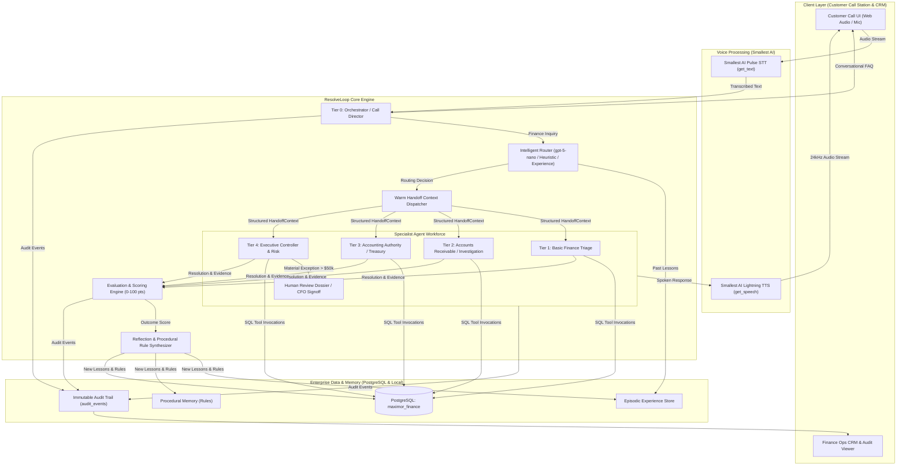
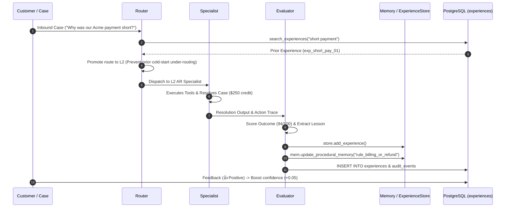

# Maximor AI / ResolveLoop: End-to-End System Flows Specification

> **Status:** Live & Implemented (Snapshot as of September 2026)  
> **Target Audience:** Engineering, Architecture, Product, Compliance & Hackathon Evaluators  
> **Runtime Stack:** Python 3.14, Flask, PostgreSQL (`maximor_finance`), Smallest AI (Pulse STT & Lightning TTS), OpenAI `gpt-5-nano`  

---

## Table of Contents

1. [System Architecture & Runtime Overview](#1-system-architecture--runtime-overview)
2. [Flow 1: Customer Call Flow (End-to-End Voice & Hands-Free Interaction)](#flow-1-customer-call-flow-end-to-end-voice--hands-free-interaction)
3. [Flow 2: Orchestrator Front Door & Direct Conversational Resolution](#flow-2-orchestrator-front-door--direct-conversational-resolution)
4. [Flow 3: Warm Handoff & Structured Context Passing](#flow-3-warm-handoff--structured-context-passing)
5. [Flow 4: Agent Level Flows (L1–L4 Roles & Tool Authority)](#flow-4-agent-level-flows-l1l4-roles--tool-authority)
6. [Flow 5: Finance Tools Flow & System Integrations](#flow-5-finance-tools-flow--system-integrations)
7. [Flow 6: Closed-Loop Learning & Procedural Rule Synthesis](#flow-6-closed-loop-learning--procedural-rule-synthesis)
8. [Flow 7: Database & Persistence Architecture (PostgreSQL Schema)](#flow-7-database--persistence-architecture-postgresql-schema)
9. [Flow 8: Compliance Audit Trail & Case Trace Lifecycle](#flow-8-compliance-audit-trail--case-trace-lifecycle)
10. [Flow 9: Text Fallback & Offline/Mock/Heuristic Resilience](#flow-9-text-fallback--offlinemockheuristic-resilience)
11. [Flow 10: Testing & Comparative Learning Benchmark Flow](#flow-10-testing--comparative-learning-benchmark-flow)
12. [Observed Gaps & Architecture Insights](#12-observed-gaps--architecture-insights)

---

## 1. System Architecture & Runtime Overview

Maximor AI (ResolveLoop) operates as an autonomous, self-improving finance operations workforce. The architecture combines a tiered specialist hierarchy (Tier 0 Orchestrator, Tier 1 Triage, Tier 2 AR/AP, Tier 3 Accounting/Treasury, Tier 4 Executive Controller), live PostgreSQL databases, Smallest AI voice streaming, OpenAI `gpt-5-nano` reasoning, and an episodic closed-loop learning engine.



---

## Flow 1: Customer Call Flow (End-to-End Voice & Hands-Free Interaction)

### Trigger
User clicks the animated glowing **CALL** button on the Customer Call Station (`/demo`).

### Step-by-Step Execution Sequence
1. **Call Initialization & Spoken Greeting (`POST /api/voice/greet`)**:
   - Web frontend sends customer identity (`customer_id: "cust1"`).
   - Backend retrieves caller record: Alice Morgan, Finance Director at Apex Global Technologies (`get_customer`).
   - Smallest AI Lightning TTS synthesizes greeting:  
     *"Thanks for calling Maximor AI. Hi Alice Morgan, how can I help you today?"*
   - Audio is streamed to browser (`/api/audio/greet_cust1_<timestamp>.wav`) and auto-played.
   - Audit event `CALL_INITIALIZED_GREETING` is recorded in PostgreSQL.

2. **Transition to In-Call Workstation**:
   - Standby hero UI is hidden; live in-call workstation is revealed.
   - Call duration timer starts.
   - Active agent badge initializes to `Orchestrator · Call Director · L0`.

3. **Hands-Free Voice Activity Detection (VAD) Listening Loop**:
   - Frontend accesses microphone via `navigator.mediaDevices.getUserMedia({ audio: true })`.
   - Web Audio API `AudioContext` and `AnalyserNode` process real-time audio samples every 100ms.
   - Root Mean Square (RMS) volume is computed. When `RMS > 0.05`, `speechDetectedInTurn` is set to `true`, lighting up the green microphone wave ring.
   - When speech ceases, trailing silence timer starts. If silence lasts $\ge 1800\text{ ms}$ (`SILENCE_THRESHOLD_MS`), frontend automatically triggers **End of Turn**.
   - `MediaRecorder` stops recording and packages audio chunks into a `webm` Blob.

4. **Audio Ingestion & Normalization (`POST /api/voice/call`)**:
   - Multipart payload containing `audio` (`Blob`) and `customer_id` is posted to Flask.
   - Web server receives file, writes temporary file, and normalizes it to **24,000 Hz, 1-channel mono PCM WAV** via `ffmpeg`.

5. **Speech-to-Text Transcription**:
   - `SmallestAIVoiceClient.transcribe_audio_pulse()` posts audio bytes to Smallest AI Pulse API (`https://waves-api.smallest.ai/api/v1/pulse/get_text`).
   - Returns transcript string (e.g. *"Why was our Acme payment short?"*).

6. **Core Engine Execution (`ResolveLoopEngine.run_once`)**:
   - A `Case` object is generated (`id: "VOICE-<timestamp>"`).
   - Orchestrator evaluates query intent and initiates warm handoff to L2 Accounts Receivable Specialist.
   - Specialist tools retrieve ERP invoice, Stripe remittance, customer history, and policy `SHORT-PAY-01`.
   - Complete resolution synthesized: verifies 2/10 Net 30 window and approves $250 prompt payment discount.

7. **Speech Synthesis (`SmallestAIVoiceClient.synthesize_speech_lightning`)**:
   - Spoken resolution text posted to Smallest AI Lightning API (`https://api.smallest.ai/waves/v1/lightning-v3.1/get_speech`).
   - Generates natural 24kHz WAV audio (`data/voice_responses/voice_response_<case_id>.wav`).

8. **Playback & Hands-Free Auto-Resumption**:
   - Frontend plays agent speech audio.
   - `audioPlayer.onended` immediately re-invokes `startHandsFreeListening()`.
   - Microphone opens for the customer's next turn with **zero button clicks**.

### Voice Error Handling & Non-Fatal Fallback
- **Microphone Denied / Browser Incompatible**: UI catches `getUserMedia` error, updates status pill to *"Microphone Inactive"*, and highlights text input box.
- **Missing `SMALLEST_API_KEY`**: Backend marks `fallback_active = True`. STT attempts local Whisper transcription if installed; TTS logs fallback note and returns text without crashing.
- **Audio API Network Timeout / Error**: Server catches exception, logs failure, returns text resolution, and frontend resumes ready mode without dropping the active call session.

### Inputs & Outputs
- **Input**: Microphone audio stream (`audio/webm` or `audio/wav`), `customer_id`.
- **Output**: JSON payload (`transcription`, `orchestrator_speech`, `specialist_speech`, `audio_url`, `handoff_context`, `evidence`, `ticket`), played audio WAV.

### Implementing Files
- [`resolve_loop/templates/index.html`](file:///home/jankari/.ao/data/worktrees/syndicate_ao/syndicate_ao-2/resolve_loop/templates/index.html#L790-L915) (VAD loop, MediaRecorder, audio playback)
- [`resolve_loop/web_app.py`](file:///home/jankari/.ao/data/worktrees/syndicate_ao/syndicate_ao-2/resolve_loop/web_app.py#L111-L244) (`/api/voice/greet`, `/api/voice/call`, `normalize_audio_to_wav`)
- [`resolve_loop/voice.py`](file:///home/jankari/.ao/data/worktrees/syndicate_ao/syndicate_ao-2/resolve_loop/voice.py#L37-L195) (`SmallestAIVoiceClient`)

---

## Flow 2: Orchestrator Front Door & Direct Conversational Resolution

```
Caller Inquiry ──► Orchestrator (Tier 0 Call Director)
                        │
         Is query general/conversational?
         ("Who are you?", "What is Maximor?", "What can you help with?")
                        │
         ┌──────────────┴──────────────┐
         ▼                             ▼
       YES                             NO (Finance Domain Identified)
  Answer Directly                 Initiate Warm Handoff
  - handoff_required: False       - Detect Domain & Entities
  - acting_agent: Orchestrator    - Build HandoffContext
  - No specialist transferred     - Route to L1, L2, L3, or L4
```

### Trigger
Caller speaks or types a conversational or meta inquiry (e.g., *"Who are you and what can you help me with?"*).

### Step-by-Step Execution Sequence
1. **Front-Door Ingestion**:
   - `ResolveLoopEngine.solve_case` records audit event `ORCHESTRATOR_ANSWERED`.
2. **Intent Classification (`is_general_conversational`)**:
   - Analyzes text against conversational regex patterns (`who are you`, `what is maximor`, `what can you do`, `help me with`, `hello`, etc.).
   - Asserts absence of finance-specific entity keywords (`invoice`, `bill`, `payment`, `short`, `discount`, `runway`, `variance`, `4471`, `7701`).
3. **Direct Speech Generation**:
   - Orchestrator synthesizes direct reply:  
     *"You're speaking with Maximor AI. I'm a finance operations assistant. I can help with invoices, payments, revenue, cash, reporting, and other finance operations. What can I help you with today?"*
4. **Audit Logging**:
   - Logs `ORCHESTRATOR_DIRECT_REPLY` with `source_agent: "Orchestrator (Call Director)"` and `outcome: "Resolved directly without transfer"`.
   - Logs `RESOLUTION_GENERATED`.
5. **Payload Return**:
   - Returns `handoff_required: False`, `acting_agent: "Orchestrator (Call Director)"`, `specialist_speech: None`.
6. **UI Display**:
   - Active agent badge stays `Call Director · L0`.
   - Response appears in transcript directly from Orchestrator without a specialist handoff banner.

### Inputs & Outputs
- **Input**: Query text (e.g. *"Who are you?"*).
- **Output**: Direct conversational answer, `handoff_required: False`.

### Implementing Files
- [`resolve_loop/engine.py`](file:///home/jankari/.ao/data/worktrees/syndicate_ao/syndicate_ao-2/resolve_loop/engine.py#L90-L147) (`is_general_conversational`, `route_case`)
- [`resolve_loop/engine.py`](file:///home/jankari/.ao/data/worktrees/syndicate_ao/syndicate_ao-2/resolve_loop/engine.py#L291-L340) (Direct answer execution & audit logging)

---

## Flow 3: Warm Handoff & Structured Context Passing

```
[Customer Request] 
      │
      ▼
[Orchestrator]
  1. Detects Domain & Entities (Invoice INV-4471, PMT-8821, $250)
  2. Generates Orchestrator Statement ("I'm bringing in our AR Specialist...")
  3. Constructs Structured HandoffContext Object
      │
      ▼
[Specialist Agent (e.g. L2 Accounts Receivable)]
  1. Ingests HandoffContext (No repeating questions!)
  2. Issues Contextual Acknowledgement ("Hi Alice, I've received context...")
  3. Executes Database Tools (get_invoice, get_payment, search_policy)
  4. Generates Financial Resolution ($250 credit applied per SHORT-PAY-01)
```

### Trigger
Caller submits a finance-specific operational request requiring database access, policy validation, or escalation.

### Step-by-Step Execution Sequence
1. **Entity & Domain Detection**:
   - Engine identifies domain (e.g., `accounts_receivable`), target entities (`invoice_id: "INV-4471"`, `payment_id: "PMT-8821"`, `amount: 250.00`), and target tier (`L2 AR Specialist`).
2. **Orchestrator Transfer Statement**:
   - Orchestrator explains handoff to caller:  
     *"I've got the details. This requires checking your invoice, payment history, and Accounts Receivable policy, so I'm going to bring in our Accounts Receivable specialist. I'll pass along what you've already told me so you won't have to repeat yourself."*
3. **`HandoffContext` Assembly**:
   - An immutable dataclass is populated with full operational state:
     - `handoff_id`: Unique UUID (`hnd_<hex>`).
     - `case_id`: Current active case.
     - `customer`: Caller profile (`Alice Morgan`, `Apex Global`).
     - `organization`: Org metadata (`org_apex`, `B2B Enterprise Software`).
     - `detected_domain` & `issue_type`: `accounts_receivable`, `short_payment`.
     - `current_agent` & `receiving_agent`: Orchestrator $\to$ L2 AR Specialist.
     - `reason_for_handoff`: Tool authority requirements.
     - `entities_already_identified`: Collected keys and numbers.
     - `tools_already_used`: Prior tool trace.
     - `relevant_finance_records`: Pre-fetched records from NetSuite / Stripe.
     - `relevant_policy`: Authoritative policy object (`SHORT-PAY-01`).
     - `unresolved_questions` & `recommended_next_action`.
     - `routing_confidence` (0.94) & `resolution_confidence` (0.95).
4. **Specialist Ingestion & Acknowledgement**:
   - Specialist receives `HandoffContext` and generates an acknowledgement without greeting repetition:  
     *"Hi Alice, I've received the context from the previous assistant. I understand you're calling about the Acme payment that was short by $250. I'll check the invoice, payment, and account history to determine what caused the difference."*
5. **Tool Execution & Resolution**:
   - Specialist applies policy rules and produces final financial settlement.
6. **Multi-Hop Escalation (Tier Escalation)**:
   - If an L2 case involves ambiguous policy terms or exceeds $50,000, L2 escalates to L4 (`Executive Controller & Chief Risk Officer`).
   - L4 prepares a Human Review dossier for corporate Controller/CFO signoff under policy `ESC-400`.
7. **Handoff Failure Fallback (Test Case G)**:
   - If specialist initialization raises an error or network times out:
     - `except Exception as handoff_err` traps failure.
     - Logs `HANDOFF_FAILED_FALLBACK_TO_ORCHESTRATOR`.
     - Control returns to Orchestrator (`acting_agent = "Orchestrator (Call Director)"`, `fallback_engaged = True`).
     - Orchestrator reassures caller: *"I experienced a brief delay connecting with our specialist, but I am staying on the line with you. I've noted your request and our finance operations team is actively looking into it. How else may I assist you in the meantime?"*
     - The call never drops or crashes.

### Implementing Files
- [`resolve_loop/engine.py`](file:///home/jankari/.ao/data/worktrees/syndicate_ao/syndicate_ao-2/resolve_loop/engine.py#L42-L78) (`AgentProfile`, `HandoffContext`)
- [`resolve_loop/engine.py`](file:///home/jankari/.ao/data/worktrees/syndicate_ao/syndicate_ao-2/resolve_loop/engine.py#L447-L602) (Scenario handoffs & context assembly)
- [`resolve_loop/engine.py`](file:///home/jankari/.ao/data/worktrees/syndicate_ao/syndicate_ao-2/resolve_loop/engine.py#L750-L803) (Graceful failover trap)

---

## Flow 4: Agent Level Flows (L1–L4 Roles & Tool Authority)

| Tier | Agent Role | Trigger Scenario | Tool Permissions & Capabilities | Resolution Outcome |
| :--- | :--- | :--- | :--- | :--- |
| **Tier 0** | **Orchestrator / Call Director** | Inbound call intake, conversational meta-queries (*"Who are you?"*), greeting | Direct dialog, intent classification, warm handoff routing | Direct answer or warm transfer to specialist |
| **Tier 1** | **Basic Finance Triage** | Simple invoice lookup, status checks, FAQs (*"What's the status of invoice INV-4471?"*) | `get_invoice`, `search_finance_records`, `fetch_customer_profile`, `kb_search` | NetSuite ERP status reporting (balance due, payment dates) |
| **Tier 2** | **Accounts Receivable / Investigation** | Short payments, discount disputes (*"Why was payment PMT-8821 short by $250?"*) | `get_invoice`, `get_payment`, `get_fin_customer_history`, `get_policy_version` (`SHORT-PAY-01`) | Validates 2/10 Net 30 window; approves $250 discount credit; marks invoice settled |
| **Tier 3** | **Accounting Authority & Treasury** | Cloud budget variance (*BILL-7701*), liquidity position, runway inquiries | `get_bill`, `get_journal_entry` (`JE-2026-03`), `get_cash_position`, `get_forecast` | Correlates compute surge with GPU inference; posts GL accruals; provides 13-week runway |
| **Tier 4** | **Executive Controller & Risk Authority** | Material policy exceptions, amounts > $50,000, ambiguous credit terms | `get_policy_version` (`ESC-400`), `policy_override`, human review dossier dispatch | Automated settlement blocked; prepares comprehensive audit dossier for CFO/Controller |

---

## Flow 5: Finance Tools Flow & System Integrations

All finance tools are implemented in [`resolve_loop/finance_tools.py`](file:///home/jankari/.ao/data/worktrees/syndicate_ao/syndicate_ao-2/resolve_loop/finance_tools.py) and execute parameterized SQL queries against PostgreSQL.

```
Agent Action ──► Tool Function (e.g. get_invoice)
                      │
                      ├──► Executes Parameterized SQL on PostgreSQL
                      ├──► Logs Execution to 'tool_calls' Table (Latency, Input, Output)
                      └──► Returns Structured Financial Data Object
```

### Registered Finance Tools
1. `get_customer(customer_id)`: Fetches organization, contact info, and preferred channel from `customers` table.
2. `get_fin_customer_history(customer_id)`: Retrieves total billed, total paid, average days to pay, and aging balance.
3. `get_invoice(invoice_id)`: Queries NetSuite invoice records from `finance_records` where `record_type = 'invoice'`.
4. `get_payment(payment_id)`: Queries Stripe / JPMC remittance records where `record_type = 'payment'`.
5. `get_bill(bill_id)`: Queries vendor AP bills (e.g. AWS `BILL-7701`, Snowflake `BILL-7702`).
6. `search_finance_records(query, record_type)`: ILIKE search across external IDs, entities, and JSONB payloads.
7. `search_policy(query)`: Searches policy catalog for controls matching keyword or domain.
8. `get_policy_version(policy_code, version)`: Retrieves exact rules and thresholds for a versioned policy (e.g., `SHORT-PAY-01` v2.1 or `ESC-400` v1.0).
9. `get_journal_entry(journal_entry_id)`: Retrieves General Ledger accrual entries from `finance_records`.
10. `get_reconciliation(reconciliation_id)`: Retrieves multi-entity balance sheet reconciliations (e.g., `CONSOL-2026-Q2`).
11. `get_revenue_schedule(contract_id)`: Queries ASC 606 ratable revenue recognition schedules.
12. `get_cash_position()`: Fetches real-time liquidity ($18.45M), operating checking, and money market yield from JPMC Treasury.
13. `get_forecast(timeframe)`: Extracts 13-week FP&A cash runway projections and net burn rates.
14. `search_experiences(domain, situation_query)`: Queries past episodic memory in PostgreSQL.
15. `record_feedback(case_id, rating, reason, comment)`: Stores thumbs up/down user ratings and adjusts confidence weights.
16. `record_audit_event(case_id, action, details)`: Appends immutable entries to `audit_events`.
17. `log_tool_call(case_id, tool_name, input, output, start_time, success)`: Records millisecond latency and payloads into `tool_calls`.

---

## Flow 6: Closed-Loop Learning & Procedural Rule Synthesis



### The 8-Stage Closed Loop
1. **CASE**: Inbound customer problem ingested.
2. **RETRIEVE EXPERIENCES**: Store searches past similar cases via token overlap and SQL similarity.
3. **ROUTE**: If past experience shows cold-start L1 failure or recommended route, router elevates tier (e.g. L1 $\to$ L2).
4. **SOLVE & TOOLS**: Specialist executes tools (`get_invoice`, `get_payment`, `get_policy_version`).
5. **EVALUATE**: Evaluator scores resolution (0–100) based on resolution quality, tool efficiency, and escalation penalty.
6. **REFLECT**: Generates operational lesson (e.g., *"For short payments on 2/10 Net 30 terms, auto-apply discount if within 10 days"*).
7. **STORE EXPERIENCE**: Experience saved to local `data/experiences.json` and PostgreSQL `experiences` table.
8. **IMPROVE NEXT CASE**: Procedural rule ensures future cases bypass L1 triage and resolve in a single turn.

### Feedback Loop Integration
- When caller clicks **Thumbs Up** (👍) or **Thumbs Down** (👎):
  - `POST /api/feedback` calls `record_feedback()`.
  - Positive feedback: `UPDATE experiences SET confidence = LEAST(confidence + 0.05, 0.99)`.
  - Negative feedback: `UPDATE experiences SET confidence = GREATEST(confidence - 0.15, 0.50)`.
  - An audit event `CUSTOMER_FEEDBACK_RECORDED` is committed to PostgreSQL.

---

## Flow 7: Database & Persistence Architecture (PostgreSQL Schema)

The PostgreSQL database `maximor_finance` contains 14 relational tables configured with foreign keys, indexes, and JSONB structures:

```
organizations (Enterprise Tenancy)
  ├── users (Finance Operations Staff: Controller, CFO, AP/AR Managers)
  ├── customers (Corporate Clients: Alice Morgan, Bob Jenkins, Charlie Davis)
  ├── finance_systems (NetSuite ERP, Stripe, Salesforce, JPMC Treasury, Workday)
  ├── finance_records (Polymorphic: invoices, payments, bills, JEs, cash balances)
  ├── policies (Authoritative controls: SHORT-PAY-01, REV-REC-01, ESC-400)
  ├── cases (Operational cases)
  │     ├── agent_runs (LLM runs & token metrics)
  │     │     └── tool_calls (Auditable execution trace & latency)
  │     ├── escalations (Human review records)
  │     ├── feedback (Thumbs up/down ratings)
  │     └── audit_events (Compliance event journal)
  └── experiences (Episodic memory for closed-loop learning)
        └── learned_policies (Synthesized corporate rules)
```

### Resilience & Dual-Mode Engine
- `Database` class in [`resolve_loop/db.py`](file:///home/jankari/.ao/data/worktrees/syndicate_ao/syndicate_ao-2/resolve_loop/db.py#L233-L321):
  - Attempts PostgreSQL connection via `psycopg2`.
  - If PostgreSQL is offline, automatically initializes local SQLite schema at `data/maximor_finance.db`.
  - Schema creation (`init_schema()`) and seeding (`seed_database()`) are fully idempotent via `ON CONFLICT DO UPDATE`.

---

## Flow 8: Compliance Audit Trail & Case Trace Lifecycle

Every handoff and decision logs an immutable record to the `audit_events` table.

### Standard Audit Event Schema
Every row contains:
- `source_agent`: Originating agent or human (e.g. `Orchestrator (Call Director)`).
- `destination_agent`: Target agent, system, or customer (e.g. `Accounts Receivable Specialist`).
- `handoff_reason`: Business justification for the transition.
- `confidence`: Numeric confidence score (0.00–1.00).
- `context_summary`: Concise summary of state transferred.
- `timestamp`: Epoch floating-point timestamp.
- `outcome`: Operational result.

### Complete 13-Stage Audit Trail Lifecycle (Test Case C Walkthrough)
1. `CASE_CREATED`: Customer inquiry logged (`source: Customer` $\to$ `dest: Orchestrator`).
2. `ORCHESTRATOR_ANSWERED`: Call director receives inquiry and begins evaluation.
3. `CASE_PROCESSING_STARTED`: Routing evaluation initiated.
4. `INTENT_DETECTED`: Classified as `short_payment` in `accounts_receivable`.
5. `ROUTED_TO_L2`: Assigned to Tier 2 AR Specialist.
6. `WARM_HANDOFF_INITIATED`: Structured `HandoffContext` generated.
7. `SPECIALIST_ACKNOWLEDGED_CONTEXT`: Receiving specialist confirms context without repeating greeting.
8. `CUSTOMER_HISTORY_RETRIEVED`: Account history retrieved from NetSuite ERP.
9. `POLICY_RETRIEVED`: Rules for `SHORT-PAY-01` loaded.
10. `CALLED_INVOICE_TOOL`: Invoice `INV-4471` details loaded.
11. `CALLED_PAYMENT_TOOL`: Remittance advice `PMT-8821` verified.
12. `RESOLUTION_GENERATED`: $250 prompt payment discount approved; invoice marked settled.
13. `CUSTOMER_FEEDBACK_RECORDED`: Customer marks resolution positive.
14. `EXPERIENCE_STORED`: Case resolution indexed into episodic memory.

---

## Flow 9: Text Fallback & Offline/Mock/Heuristic Resilience

The system operates across multiple resilient fallback tiers:

```
[Voice Mode: Mic & Smallest AI] ──(API Key Missing or Mic Denied)──► [Text Chat Input / Scenarios]
[LLM Mode: OpenAI gpt-5-nano]   ──(RESOLVELOOP_USE_LLM=0)──────────► [Deterministic Heuristic Router]
[PostgreSQL Database]           ──(Connection Unavailable)─────────► [Local SQLite Database]
[Specialist Agent Execution]    ──(Initialization Failure)─────────► [Graceful Orchestrator Fallback]
```

1. **Text Fallback Workstation (`POST /api/text/call`)**:
   - Callers can type directly into the text chat input or click quick scenario buttons (*"Why was payment short?"*, *"Invoice status"*, *"AWS budget variance"*, *"Treasury cash position"*).
   - Text calls execute the exact same routing, tool execution, and audit trail pipelines as voice calls.
2. **Deterministic Heuristic Routing**:
   - If `RESOLVELOOP_USE_LLM=0` or `OPENAI_API_KEY` is not present, `route_case()` employs deterministic keyword routing, procedural memory rules, and experience history matching.
3. **Graceful Failover on Specialist Crash (Test Case G)**:
   - If a specialist component fails, the engine catches the exception, logs `HANDOFF_FAILED_FALLBACK_TO_ORCHESTRATOR`, and keeps the Orchestrator on the line with the customer. The call session is never dropped.

---

## Flow 10: Testing & Comparative Learning Benchmark Flow

The test suite validates both operational capabilities and adaptive learning:

```bash
python3 -m unittest discover tests
```

### Test Suites Overview (16 Tests Total)
1. **`tests/test_finance_ops.py` (9 Tests)**:
   - `test_database_records_retrieval`: Queries customers, invoices, payments, bills, policies, and cash.
   - `test_case_a_basic_conversational`: Validates Orchestrator direct answers without handoff.
   - `test_case_b_l1_invoice_status`: Validates L1 triage lookup without repeated greetings.
   - `test_case_c_l2_short_payment_and_audit_trail`: Validates L2 AR resolution and full 13-stage audit lifecycle.
   - `test_case_d_l4_ambiguous_policy_escalation`: Validates L4 Executive Controller escalation and human review.
   - `test_case_f_voice_handoff_endpoints`: Validates `/api/voice/greet`, `/api/text/call`, and audio streaming.
   - `test_case_g_handoff_failure_fallback`: Validates failover resilience on specialist initialization error.
   - `test_feedback_system_updates_experience_confidence`: Validates thumbs up/down weight updates.
   - `test_web_endpoints`: Validates `/api/status` and `/api/crm/data`.
2. **`tests/test_experience_store.py` (2 Tests)**: Validates episodic memory persistence, retrieval, and similarity scoring.
3. **`tests/test_router_and_learning.py` (3 Tests)**: Validates cold vs warm routing and procedural memory synthesis.
4. **`tests/test_voice.py` (2 Tests)**: Validates Smallest AI Pulse STT and Lightning TTS endpoints and error fallbacks.

### Comparative 2-Pass Learning Benchmark (`Benchmark`)
Triggered via CLI (`python3 -m resolve_loop.main --benchmark`) or CRM (`POST /api/benchmark/run`):
- **Pass 1 (Cold Start)**: Processes standard cases with an empty experience store. Cases suffer under-routing and repeated escalations.
- **Pass 2 (Warm Start)**: Re-runs the same cases with populated episodic and procedural memory.
- **Verification Criteria**:
  - Score increase ($\Delta > +15$ pts).
  - Escalation reduction ($\Delta < -50\%$).
  - Zero repeated under-routing errors.

---

## 12. Observed Gaps & Architecture Insights

During this documentation and verification pass, the following design decisions and future production horizons were cataloged:

1. **Turn-Based VAD vs. Full-Duplex WebSockets**:
   - *Current Implementation:* Uses client-side Web Audio VAD with ~1.8s trailing silence detection, posting a packaged audio Blob to `/api/voice/call`. This provides reliable, crisp turn taking for hackathon demonstrations.
   - *Production Horizon:* Migrate to a bidirectional WebSocket stream for interruptible full-duplex conversational audio.
2. **Deterministic Tool Dispatch vs. Function Calling Schema**:
   - *Current Implementation:* Tool execution within `solve_case` is deterministic and scenario-driven based on identified financial entities, ensuring 100% audit compliance and preventing hallucinated tool calls.
   - *Production Horizon:* Complement deterministic rules with OpenAI function-calling schema definitions for open-ended exploratory tool chaining.
3. **Multi-Party Voice Conferencing**:
   - *Current Implementation:* Warm handoffs concatenate the Orchestrator transfer statement and Specialist greeting into a unified sequential speech stream.
   - *Production Horizon:* Integrate multi-agent voice rooms where distinct agent voice personas (e.g. different Smallest AI `voice_id`s) speak sequentially on the live call channel.
