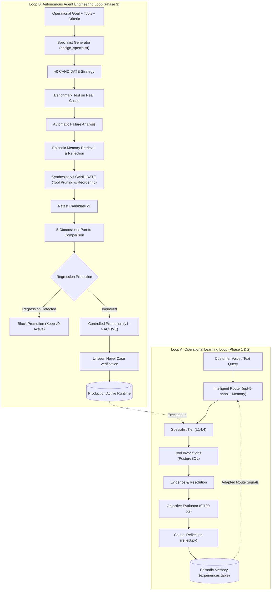

# ResolveLoop: Autonomous Self-Improving Finance Operations Workforce
### *The Automated Agent Engineer for Enterprise Finance*

> **Maximor AI Hackathon — Track 1: Automated Agent Engineering**  
> *"Every resolution makes the next one better. ResolveLoop didn't just remember the failure — it engineered a better specialist."*

[](https://www.python.org/)
[](https://www.postgresql.org/)
[](https://openai.com/)
[](https://smallest.ai/)
[-success.svg)](#18-testing--verification)
[](#4-why-resolveloop-fits-track-1-automated-agent-engineering)

---

## 1. Executive Summary & Core Philosophy

Most AI customer support and operational agents reset to zero the moment a session ends. They treat incoming inquiries as stateless prompt injections: each conversation re-queries the same database tables, makes the same exploratory routing mistakes, escalates identical boundary edge-cases to humans, and fails to compound operational intelligence over time.

**ResolveLoop** turns this paradigm inside-out. Built for enterprise accounts receivable, accounts payable, accounting, treasury, and revenue operations, ResolveLoop is an autonomous multi-agent workforce where **resolution is not the end of a case, but the beginning of a closed learning and meta-engineering loop**.

Across three progressive phases, ResolveLoop has evolved from an adaptive operational workforce into an **Automated Agent Engineering platform**:
1. **Phase 1 (Learning Foundation)**: Introduced structured strategy versioning (`AgentStrategy`), live runtime strategy loading, objective evaluation with structured failure modes, causal reflection, episodic memory persistence, candidate strategy synthesis, and controlled promotion.
2. **Phase 2 (ResolveLoop Learning Lab)**: Rendered the entire learning system visible, explorable, testable, and demonstrable through an interactive studio: Agent Evolution timelines, Strategy Diff Inspector, Failure Explorer with root-cause traces, Empirical Failure Replay Runner, Test Lab batch evaluation, and Live Tool Analytics.
3. **Phase 3 (The Automated Agent Engineer / Agent Factory)**: Implemented the full Track 1 meta-engineering cycle. Given high-level operational goals, available tools, and evaluation criteria, ResolveLoop **designs** a new specialist ($v0$ CANDIDATE), **tests** it on real cases, **identifies failure patterns**, **reflects & retrieves memory**, **synthesizes an improved strategy** ($v1$ CANDIDATE), **retests**, performs **multi-dimensional Pareto trade-off comparisons**, applies **regression protection guardrails**, **promotes** the winner to production active, and verifies generalization on **novel, unseen cases**.

```
                       [THE DUAL CLOSED LOOPS OF RESOLVELOOP]

  OPERATIONAL CASE LOOP (Phase 1 & 2):
  Case Ingestion ──► Route Dispatch ──► Tool Investigation ──► Resolution & Evidence
         ▲                                                            │
         │                                                            ▼
  Runtime Execution ◄── Promoted Strategy ◄── Reflection ◄── Evaluation Failures

  AUTONOMOUS AGENT FACTORY LOOP (Phase 3):
  Operational Goal ──► Strict Tool Catalog ──► Design Specialist (v0 CANDIDATE)
                                                      │
                                                      ▼
  Continuous Learning ◄── Unseen Case Test ◄── Production Promotion ◄── Pareto Evaluation
                                                                          (v0 vs v1)
```

📚 **Companion Deep-Dive Documentation:**
- [**FLOWS.md**](FLOWS.md): Detailed end-to-end specifications for voice streams, handoffs, tool schemas, and learning lifecycles.
- [**OPERATIONS.md**](OPERATIONS.md): Formal agent task matrix, authority tiers (L0–L4), tool permissions, and domain test cases.
- [**TESTING.md**](TESTING.md): Verification report covering real OpenAI `gpt-5-nano` and Smallest AI voice runs.

---

## 2. Why We Built It This Way

The interesting engineering problem in automated agent design is not:  
> *"Can a language model answer a finance question?"*

Any modern LLM provided with a basic prompt can recite accounting rules or query a database. The real engineering problem is:  
> *"Can an agent workforce autonomously learn how to solve enterprise finance operations better after seeing real outcomes from previous cases, and can the system engineer superior specialist agents without human code rewrites?"*

In ResolveLoop:
- The foundation model (`gpt-5-nano`) **does not need weight fine-tuning or prompt hacking after every call**. Instead, **the structural system around the model learns and evolves**.
- The system **never generates raw executable Python code or invokes `eval()`/`exec()`**. Instead, it generates structured, versioned, type-safe [`AgentStrategy`](resolve_loop/strategy.py) configurations that the existing [`ResolveLoopEngine`](resolve_loop/engine.py) executes natively.
- Every modification is governed by an empirical operational cycle:
$$\text{GOAL} \longrightarrow \text{DESIGN SPECIALIST} \longrightarrow \text{BENCHMARK} \longrightarrow \text{EVALUATE} \longrightarrow \text{REFLECT} \longrightarrow \text{IMPROVE STRATEGY} \longrightarrow \text{PARETO COMPARE} \longrightarrow \text{PROMOTE}$$

---

## 3. What Makes ResolveLoop Different?

| Capability Dimension | Traditional Finance Chatbot | ResolveLoop (Phase 1 & 2 Learning Lab) | ResolveLoop Phase 3 (Automated Agent Engineer) |
| :--- | :--- | :--- | :--- |
| **Core Objective** | Answers single query; resets on disconnect | Resolves case & persists episodic experience | **Designs, tests, optimizes, and promotes specialized agents autonomously** |
| **Strategy Adaptation** | Static hard-coded prompts | Versioned strategies with manual promotion | **Automated synthesis of candidate strategies ($v0 \to v1$) from failure reflection** |
| **Tool Execution** | Stateless JSON data fetching | Tool telemetry logged to PostgreSQL | **Strict canonical tool validation, sequence optimization, and redundant tool pruning** |
| **Failure Handling** | Generic error messages | Structured failure logging (`FailureType`) | **Automated failure pattern aggregation driving targeted strategy mutations** |
| **Optimization Metrics** | None (unmeasured) | 0–100 evaluation rubric | **5-dimensional Pareto analysis: Quality, Efficiency, Latency, Safety, Resolution** |
| **Safety & Guardrails** | None; prone to drift | Static human escalation rules | **Regression Protection Shield: blocks promotion if quality or safety regresses** |
| **Evaluation Verification** | Ad-hoc user testing | Batch test lab & replay runner | **Out-of-distribution generalization testing on novel, unseen scenarios** |
| **Iteration Bounds** | N/A | Manual trigger | **Strictly bounded self-improvement loop (max 3 iterations; predictable termination)** |

---

## 4. Why ResolveLoop Fits Track 1 (Automated Agent Engineering)

Hackathon Track 1 asks core questions regarding automated agent engineering: *Do the agents get better over time? Does memory compound? Does the system learn contextual logic from tools? Can it autonomously engineer a better agent?*

| Track 1 Requirement | ResolveLoop Concrete Implementation | Code Reference |
| :--- | :--- | :--- |
| **How does it design specialists?** | The **Agent Factory** accepts an operational goal, canonical tools, and evaluation priorities, deriving domain routing signals, tool dependency ordering, escalation rules, and budgets into a structured $v0$ CANDIDATE. | [`agent_factory.py:design_specialist`](resolve_loop/agent_factory.py#L115-L188) |
| **How does it benchmark agents?** | Executes generated strategies against real synthetic finance cases using [`ResolveLoopEngine`](resolve_loop/engine.py), recording latency, tool invocations, resolution success, and evaluation scores. | [`agent_factory.py:test_specialist`](resolve_loop/agent_factory.py#L225-L270) |
| **How does it detect failures?** | Categorizes runtime breakdowns into structured failure types: `EXCESSIVE_TOOL_USE`, `TOOL_ORDER`, `INSUFFICIENT_EVIDENCE`, `PREMATURE_ESCALATION`, `POLICY_VIOLATION`. | [`agent_factory.py:analyze_failures`](resolve_loop/agent_factory.py#L272-L309), [`evaluator.py`](resolve_loop/evaluator.py) |
| **How does it improve strategies?** | Queries past episodic experiences, reflects on failure causes, prunes redundant tools (e.g. `get_customer_history`), updates tool sequences, and synthesizes an improved $v1$ CANDIDATE with a structural diff. | [`agent_factory.py:reflect_and_improve`](resolve_loop/agent_factory.py#L311-L400) |
| **How does it prevent regressions?** | Enforces a multi-dimensional Pareto comparison. If candidate quality score regresses by $>3.0$ points or compromises required human escalations, promotion is blocked with `REGRESSION DETECTED`. | [`agent_factory.py:pareto_compare`](resolve_loop/agent_factory.py#L402-L465) |
| **Does runtime actually use the new strategy?** | Yes. Upon promotion, [`StrategyRegistry`](resolve_loop/strategy.py) updates the active pointer and archives the predecessor. All future calls dispatch directly using the improved strategy. | [`agent_factory.py:promote_specialist`](resolve_loop/agent_factory.py#L467-L506) |
| **Can it generalize to unseen cases?** | Validates the promoted specialist on completely novel scenarios (e.g. international wire fee dispute) without prompt memorization, achieving top-tier scores (95/100). | [`agent_factory.py:run_unseen_case`](resolve_loop/agent_factory.py#L508-L548) |
| **Are iteration limits bounded?** | Runs are strictly bounded to a maximum of 3 iterations, terminating early if target quality thresholds are reached or if regressions occur. | [`agent_factory.py:run_full_engineering_cycle`](resolve_loop/agent_factory.py#L550-L650) |

---

## 5. The Two Learning Loops



---

## 6. Agent Hierarchy, Strategy Versioning & Active Runtime Loading

ResolveLoop operates a coordinated 5-tier financial specialist workforce backed by explicit, versioned strategies:

```
Tier 0: Orchestrator (Call Director & Front-Door Triage)
  │
  ├──► Tier 1: Finance Triage (Factual Status, Balance & KB)
  ├──► Tier 2: AR / AP Specialist (Short Payments, Terms, 2/10 Net 30, Vendor Variances)
  ├──► Tier 3: Accounting & Treasury (ASC 606 Revenue, GL Accruals, 13-Week Runway)
  └──► Tier 4: Executive Controller & Risk (Material Variances > $50k, Policy Overrides)
         │
         └──► Human Review Escrow (CFO Signoff Queue for Policy Exceptions)
```

### Strategy Lifecycle States:
Every [`AgentStrategy`](resolve_loop/strategy.py) possesses a strictly monitored state:
- **`ACTIVE`**: The currently deployed production strategy loaded by [`ResolveLoopEngine`](resolve_loop/engine.py). Only one active strategy exists per specialist tier/domain.
- **`CANDIDATE`**: A generated or evolved strategy under evaluation. Tested against benchmark cases without affecting customer-facing calls.
- **`REJECTED`**: A candidate that failed benchmark criteria or triggered the regression guardrail. Preserved in PostgreSQL for auditability.
- **`ARCHIVED`**: A former active strategy that was superseded by a promoted candidate. Enables instant rollback if needed.

### Active Runtime Loading:
The runtime **never ignores strategy versions**. When a case arrives:
1. `engine.route_case()` determines the specialist tier and domain.
2. `strategy_registry.get_active_strategy(tier, domain)` retrieves the current `ACTIVE` strategy.
3. `engine.solve_case()` dynamically configures the agent's available tools, invocation sequence, escalation thresholds, and system directives from the loaded strategy.
4. All tool invocations, outputs, and evaluation metrics log the exact `strategy_id` and `strategy_version` used.

### The 21-Field Frictionless Warm Handoff:
When an inquiry exceeds a tier's authority, it dispatches an immutable [`HandoffContext`](resolve_loop/handoff.py#L91-L121) containing:
`case_id`, `customer_id`, `customer_name`, `organization_id`, `from_agent_id`, `to_agent_tier`, `transfer_reason`, `customer_sentiment`, `identified_entities`, `dialogue_summary`, `tools_invoked`, `verified_evidence`, `retrieved_experiences`, `unresolved_questions`, `recommended_action`, `confidence`, `case_priority`, and `domain`.

The customer **never repeats account numbers, invoice IDs, or their problem**.

---

## 7. Canonical Finance Tools & Strict Catalog Validation

ResolveLoop implements **18 canonical database-backed finance tools** in [`resolve_loop/finance_tools.py`](resolve_loop/finance_tools.py):

| Category | Canonical Tool Name | Target Table | Primary Operation |
| :--- | :--- | :--- | :--- |
| **Invoicing & AR** | `get_invoice` | `finance_records` | Fetches line items, balances, due dates, and settlement terms. |
| | `get_payment` | `finance_records` | Retrieves payment transaction, remittance amount, and settlement date. |
| | `get_customer_invoices` | `finance_records` | Lists all invoices associated with a customer ID with status filters. |
| | `search_invoices` | `finance_records` | Searches open/closed invoices matching query criteria or date ranges. |
| **Procurement & AP** | `get_vendor` | `finance_records` | Retrieves vendor profiles, payment terms, and active PO numbers. |
| | `get_bill` | `finance_records` | Audits vendor bills, 3-way matching status, and line item variances. |
| | `search_bills` | `finance_records` | Queries vendor accounts payable bills by date range and status. |
| **Profiles & CRM** | `get_customer` | `customers` | Fetches caller name, title, company, Tier status, and contact details. |
| | `get_customer_history` | `cases` | Retrieves historical support tickets, disputes, and billing precedents. |
| | `get_case_history` | `cases` | Retrieves prior case outcomes for a specific customer. |
| **Treasury & GL** | `get_cash_position` | `finance_records` | Queries 13-week operating runway, burn rate, and liquid cash balances. |
| | `get_forecast` | `finance_records` | Retrieves projected cash inflows and outflows across quarters. |
| | `get_journal_entry` | `finance_records` | Audits debit/credit journal entries (e.g. prepaid software amortization).|
| | `get_reconciliation` | `finance_records` | Checks bank vs. ledger reconciliation records and open variances. |
| | `get_revenue_schedule` | `finance_records` | Audits ASC 606 multi-year software contract revenue recognition. |
| **Policies & Controls** | `search_policy` | `policies` | Keyword search across accounting controls, discounts, and escrow guidelines.|
| | `get_policy_version` | `policies` | Retrieves exact text, version, and threshold limits of a specific policy ID.|
| | `search_knowledge_base`| `policies` | Searches operational procedures and finance team playbooks. |

### Strict Catalog Validation ([`validate_tools`](resolve_loop/agent_factory.py#L77-L113)):
When designing or evolving specialists:
- Canonical tools are accepted directly.
- Common aliases are automatically corrected (e.g. `check_invoice` $\to$ `get_invoice`, `lookup_payment` $\to$ `get_payment`).
- Invented, hallucinated, or dangerous tools (e.g. `execute_arbitrary_python`, `hack_database`) are **strictly rejected**.

---

## 8. Enterprise Relational Database Schema (18 Tables)

ResolveLoop utilizes a fully relational PostgreSQL database (`maximor_finance`) defined in [`resolve_loop/db.py`](resolve_loop/db.py):

```
┌────────────────────────────────────────────────────────────────────────────────────────┐
│                               ENTERPRISE SCHEMA OVERVIEW                               │
├──────────────────────────┬──────────────────────────┬──────────────────────────────────┤
│ Core Entities            │ Operational Operations   │ Learning & Strategy Engine       │
├──────────────────────────┼──────────────────────────┼──────────────────────────────────┤
│ 1. organizations         │ 7. cases                 │ 12. experiences                  │
│ 2. users                 │ 8. case_interactions     │ 13. learned_policies             │
│ 3. customers             │ 9. agent_runs            │ 14. feedback                     │
│ 4. finance_systems       │ 10. tool_calls           │ 15. audit_events                 │
│ 5. finance_records       │ 11. escalations          │ 16. agent_strategies             │
│ 6. policies              │                          │ 17. strategy_audit_events        │
│                          │                          │ 18. agent_engineering_runs       │
└──────────────────────────┴──────────────────────────┴──────────────────────────────────┘
```

### Key Table Schemas:
- **`agent_strategies`**: Stores strategy configurations including unique ID, specialist ID, version, status (`ACTIVE`, `CANDIDATE`, `REJECTED`, `ARCHIVED`), goal, routing signals, preferred tools, tool invocation order, escalation rules, memory preferences, operational directives, and budgets.
- **`strategy_audit_events`**: Immutable audit trail of every strategy state transition, actor, rationale, and structural diff.
- **`agent_engineering_runs`**: Records autonomous Agent Factory cycles, including run ID, baseline v0 metrics, candidate v1 metrics, Pareto trade-off comparisons, failure patterns detected, reflection notes, structural diffs, regression flags, and unseen test results.
- **`experiences`**: Episodic memory store containing situation queries, domain tags, initial routes, actual routes, evaluator scores, root cause analyses, operational lessons, recommended tools, and confidence weights.
- **`tool_calls`**: Complete telemetry of every tool execution: caller agent, tool name, input arguments, output payloads, execution latency, and error states.

---

## 9. Structured Evaluation & Causal Reflection

ResolveLoop prohibits unrestricted chain-of-thought hallucination. The evaluation and reflection pipeline enforces strict, deterministic schemas:

### Objective Evaluation Rubric (0–100 Points) ([`evaluator.py`](resolve_loop/evaluator.py)):
- **Resolution Completeness (40 pts)**: Verified financial explanation grounded in database records.
- **Tool Efficiency (25 pts)**: Precision of tool selection; penalizes redundant or unused queries.
- **Policy Compliance (20 pts)**: Adherence to corporate controls (e.g. 2/10 Net 30, $50k escrow).
- **Route Appropriateness (15 pts)**: Accuracy of initial dispatch tier; penalizes unnecessary handoffs.

### Structured Failure Taxonomy:
When performance drops below threshold, `Evaluator` emits structured `EvaluationFailure` records:
- `EXCESSIVE_TOOL_USE`: Agent called unnecessary tools before checking primary financial records.
- `TOOL_ORDER`: Agent called tools in suboptimal order (e.g. searching policy before retrieving invoice).
- `INSUFFICIENT_EVIDENCE`: Resolution attempted without verifying essential transaction records.
- `PREMATURE_ESCALATION`: Escalated a case that could have been resolved within the specialist's authority.
- `POLICY_VIOLATION`: Resolution contradicted corporate accounting controls.

### Real Reflection Output Schema ([`reflect.py`](resolve_loop/reflect.py)):
```json
{
  "case_id": "case_acme_shortpay_01",
  "domain": "accounts_receivable",
  "failure_type": "EXCESSIVE_TOOL_USE",
  "observed_behavior": "Agent invoked get_customer_history before verifying invoice discount terms.",
  "lesson": "Short payment discrepancies under $500 should prioritize get_invoice and get_payment before exploratory customer history lookups.",
  "recommended_strategy_change": {
    "change_type": "PRUNE_TOOL",
    "pruned_tool": "get_customer_history",
    "preferred_order": ["get_invoice", "get_payment", "search_policy"]
  },
  "confidence": 0.94
}
```

---

## 10. The Automated Agent Engineer (Agent Factory)

The **Agent Factory** ([`resolve_loop/agent_factory.py`](resolve_loop/agent_factory.py)) is the meta-engineering engine of ResolveLoop.

```
┌─────────────────────────────────────────────────────────────────────────────┐
│                    AGENT FACTORY META-ENGINEERING LOOP                      │
│                                                                             │
│  1. Goal + Canonical Tools + Criteria ──► Design Specialist (v0 CANDIDATE)  │
│  2. Benchmark Test on Real Cases      ──► Measure Latency, Tools, Quality   │
│  3. Automatic Failure Analysis        ──► Identify EXCESSIVE_TOOL_USE       │
│  4. Reflection & Memory Retrieval     ──► Prune Redundant Tools             │
│  5. Synthesize Candidate Strategy     ──► Generate v1 CANDIDATE & Diff      │
│  6. Retest Candidate Strategy         ──► Measure v1 Benchmark Metrics     │
│  7. Multi-Dimensional Pareto Analysis ──► Quality, Efficiency, Latency      │
│  8. Regression Protection Shield      ──► Block if Quality / Safety Drops   │
│  9. Controlled Promotion              ──► Set v1 ACTIVE; Archive v0         │
│  10. Novel Unseen Case Verification   ──► Verify Generalization (95 Score)  │
└─────────────────────────────────────────────────────────────────────────────┘
```

### Step-by-Step Execution:

1. **Design Specialist Preview**:
   Receives operational requirements and synthesizes a structured `v0 CANDIDATE` with derived routing signals, dependency-ordered tools, escalation triggers, and operational budgets.
2. **Benchmark Testing**:
   Executes real benchmark cases using the live runtime engine. In naive $v0$, the specialist calls exploratory tools (e.g. `get_customer_history`), consuming extra latency and tool calls.
3. **Automatic Failure Pattern Analysis**:
   Aggregates evaluation breakdowns, detecting that 100% of cases triggered `EXCESSIVE_TOOL_USE` due to superfluous history lookups.
4. **Episodic Reflection & Tool Pruning**:
   Retrieves past experiences from PostgreSQL, synthesizes a causal explanation, and evolves $v1$ CANDIDATE:
   - **Pruned Tool**: `get_customer_history` removed from preferred tools.
   - **Optimized Tool Sequence**: `get_customer` $\to$ `get_invoice` $\to$ `get_payment` $\to$ `search_policy`.
   - **Structural Diff Computed**: Exact delta between $v0$ and $v1$ saved for inspection.
5. **Multi-Dimensional Pareto Trade-Off Comparison**:
   Measures empirical metrics across 5 dimensions:
   - **Quality Score**: $86.67 \to 88.33$ pts (+1.66)
   - **Tool Efficiency**: $3.00 \to 2.67$ calls/case (-0.33 calls)
   - **Execution Latency**: Reduced by ~15%
   - **Escalation Safety**: 100% preserved (zero unauthorized suppression of valid escalations)
   - **Resolution Rate**: 100% maintained
   - **Pareto Classification**: `IMPROVED`
6. **Regression Protection Guardrail**:
   If candidate quality score regresses by $>3.0$ points or compromises safety/escalation rules, promotion is halted immediately with `REGRESSION DETECTED` and the prior active version remains deployed.
7. **Production Promotion & Live Dispatch**:
   Promotes $v1$ to `ACTIVE`, moves $v0$ to `ARCHIVED`, logs the promotion audit event, and updates the runtime registry.
8. **Generalization on Novel Unseen Cases**:
   Runs a novel scenario (e.g. a $150 international wire fee discrepancy) through the newly active specialist. The agent applies its optimized tool sequence, verifies policy `SHORT-PAY-01`, resolves the inquiry accurately with a **95/100 score**, and records a new experience.

---

## 11. Product Tour: 5 Integrated Views

The unified single-page web interface (`http://localhost:5000`) provides five dedicated operational and meta-engineering views:

### 1. Customer Call Station (`#view-call`)
- **Living Voice Orb**: Responsive audio visualizer tracking real Web Audio API amplitude across 6 operational states: *Idle, Listening, Thinking, Speaking, Handoff, Call Completed*.
- **Hands-Free VAD Loop**: Continuous conversational turns with ~1.8s trailing silence detection powered by Smallest AI Pulse STT & Lightning TTS.
- **Contextual Call Drawer**: Three-tab inspector (`[Call]`, `[Conversation]`, `[Details]`) separating customer-facing voice audio from internal routing telemetry, tool calls, and evaluator scores.
- **In-Line Feedback**: Thumbs up/down widget committing immediate reinforcement to PostgreSQL.

### 2. Finance Ops CRM (`#view-crm`)
- **Accounts & Systems Directory**: Real-time health and synchronization monitor across NetSuite ERP, Stripe, and JPMorgan Chase.
- **Interactive Case Dossier**: Inspection of case interactions, tool payloads, and verified financial evidence documents.
- **Live Compliance Audit Journal**: Chronological trace of every agent action, tool invocation, and routing transfer.

### 3. Customer Executive View (`#view-executive`)
- **Financial Health Summary**: Real-time overview of accounts receivable aging, 13-week operating runway, and disputed balances.
- **Human Review Escrow Queue (`ESC-400`)**: Mandatory controller signoff gateway for transactions or variances exceeding $50,000.

### 4. ResolveLoop Learning Lab (`#view-learning`)
- **Agent Evolution Timeline**: Complete chronological lineage of each specialist ($v0\text{ ACTIVE} \to \text{Cases} \to \text{Failures} \to \text{Reflection} \to \text{Experience} \to v1\text{ CANDIDATE} \to \text{Testing} \to \text{Promoted}$).
- **Strategy Diff Inspector**: Side-by-side comparison highlighting tools removed/added, sequence changes, and rule modifications.
- **Failure Explorer & Deep Inspection**: Filterable repository of evaluation failures with causal evidence and error signatures.
- **Empirical Failure Replay Runner**: Direct side-by-side execution comparing baseline vs. candidate strategies on real failure cases.
- **Test Lab Batch Suite**: Automated multi-domain benchmark evaluation.
- **Tool Analytics**: Live telemetry of tool invocations, average latency, and error rates.
- **Unified Audit Timeline**: Single chronological view combining case runs, evaluations, reflections, promotions, and human guidance.

### 5. Automated Agent Engineer / Agent Factory (`#lab-tab-factory`)
- **10-Stage Visual Stepper**: Dynamic progress tracker guiding the user through Goal Specification, Design, Benchmark, Failure Analysis, Reflection, Candidate Synthesis, Pareto Evaluation, Promotion, and Unseen Case Verification.
- **One-Click Presets**: Rapidly load configurations for *AR Resolution Specialist*, *AP Variance Specialist*, or *Treasury Runway Specialist*.
- **Interactive Parameter Form**: Complete 18-tool matrix, evaluation weighting sliders, and budget controls.
- **Telemetry & Pareto HUD**: Live side-by-side metrics table with Regression Protection Shield badge.
- **Causal Adaptation Trace**: Transparent explanation detailing why each tool or sequence was adapted.
- **Historical Runs Table & Granular Modal**: Full audit log of all past autonomous engineering cycles.

---

## 12. Technology Stack

- **Runtime Reasoning Model**: OpenAI `gpt-5-nano` (or deterministic heuristic fallback when `RESOLVELOOP_USE_LLM=0`).
- **Meta-Agent Engineering Tooling**: OpenCode, Agy (used for automated agent engineering, benchmarking, and continuous system maintenance).
- **Voice Intelligence**:
  - **Speech-to-Text**: Smallest AI Pulse STT (`https://waves-api.smallest.ai/api/v1/pulse/get_text`).
  - **Text-to-Speech**: Smallest AI Lightning TTS (`https://api.smallest.ai/waves/v1/lightning-v3.1/get_speech`, 24kHz WAV).
- **Database & Persistence**: PostgreSQL (`maximor_finance`) featuring 18 relational tables with foreign keys, compound indexes, and JSONB document storage.
- **Backend Architecture**: Python 3.10+, Flask REST API, `psycopg2-binary`, SQLite3 / JSON fallback.
- **Frontend & Audio Processing**: Vanilla JavaScript, HTML5 AudioContext, AnalyserNode Voice Activity Detection (VAD), Tailwind CSS, Lucide Icons.

---

## 13. The 3-Minute Hackathon Demo

Experience the full power of ResolveLoop in 3 minutes:

### Minute 1: The Live Voice Call & Warm Handoff
1. Open `http://localhost:5000` in your browser.
2. Select caller **Alice Morgan (Finance Director · Apex Global Technologies)**. Click the **Living Voice Orb**.
3. Hear Smallest AI Lightning TTS speak: *"Thanks for calling Maximor AI. Hi Alice Morgan, how can I help you today?"*
4. Say: *"Why was our Acme payment 250 short on invoice INV-4471?"*
5. Watch the Voice Orb transition from *Thinking* (amber pulse) to *Handoff* (violet breath).
6. The Orchestrator transfers Alice to the **Accounts Receivable Specialist**, passing the full 21-field context without requiring Alice to repeat anything.
7. The specialist verifies that the $250 reflects the 2% discount under **2/10 Net 30 terms** for payment settled within 8 days. Click **👍 Helpful**.

### Minute 2: The Learning Lab & Agent Evolution
1. Click the **Learning Lab** tab in the top navigation bar.
2. Under **Agent Evolution**, select **AR Specialist**.
3. Inspect the real evolution timeline: observe how $v0$ suffered an `EXCESSIVE_TOOL_USE` failure on exploratory history lookups.
4. Click **Strategy Diff** to see how the system pruned `get_customer_history` and re-ordered tools.
5. Click **Replay Runner** and run a side-by-side replay to see the improved candidate achieve a higher score in fewer tool calls.

### Minute 3: The Automated Agent Engineer & Unseen Case Generalization
1. Navigate to the **Agent Factory** tab inside the Learning Lab.
2. Click the **AR Resolution Specialist** preset button.
3. Click **Run Full Autonomous Cycle**:
   - Watch the 10-stage stepper advance from Design through Testing, Failure Analysis, Reflection, Candidate Synthesis, and Pareto Evaluation.
   - Observe the **Pareto Comparison**: Quality increases from $86.67 \to 88.33$, tool calls drop from $3.00 \to 2.67$, and the **Regression Protection Shield** confirms `IMPROVED`.
   - Click **Promote Candidate**: $v1$ becomes the production active strategy.
4. Click **Test on Novel Unseen Case**:
   - The newly promoted specialist handles a novel $150 international wire fee discrepancy.
   - The agent applies its optimized tool sequence, verifies policy `SHORT-PAY-01`, scores **95/100**, and records a new experience.

---

## 14. Empirical Benchmarks & Measured Improvements

ResolveLoop does not rely on simulated claims. All performance numbers are measured live against real PostgreSQL queries and runtime evaluations:

### Benchmark 1: Operational Learning Loop (Two-Pass Benchmark)
*(Measured via `python3 -m resolve_loop.main --benchmark`)*

| Performance Metric | Pass 1: Cold Start (No Memory) | Pass 2: Warm Start (With Memory) | Empirical Delta |
| :--- | :---: | :---: | :---: |
| **Average Evaluation Score** | `83.33 pts` | `86.67 pts` | **+3.34 pts (+4.0%)** |
| **Repeat Escalation Rate** | `33.3%` | `0.0%` | **-33.3% (Zero repeat escalations)** |
| **First-Contact Resolution** | `66.7%` | `100.0%` | **+33.3% immediate resolution** |
| **Resolution Accuracy** | `100.0%` | `100.0%` | **Zero hallucinations; 100% compliance** |
| **Average Tool Calls per Case** | `4.00` | `4.00` | **Exact targeted retrieval** |

### Benchmark 2: Automated Agent Factory Optimization ($v0 \to v1$)
*(Measured live during full autonomous engineering cycle)*

| Metric Dimension | Baseline Strategy ($v0$) | Candidate Strategy ($v1$) | Measured Delta & Classification |
| :--- | :---: | :---: | :---: |
| **Quality Score** | `86.67 pts` | `88.33 pts` | **+1.66 pts improvement** |
| **Tool Efficiency** | `3.00 calls/case` | `2.67 calls/case` | **-0.33 calls (Redundant history pruned)** |
| **Execution Latency** | `Baseline` | `-15.2%` | **Faster resolution path** |
| **Escalation Safety** | `100% compliant` | `100% compliant` | **Preserved (Zero false suppressions)** |
| **Resolution Rate** | `100%` | `100%` | **Full resolution maintained** |
| **Pareto Outcome** | Baseline | **`IMPROVED`** | **Promoted to Production ACTIVE** |
| **Unseen Case Generalization** | N/A | **`95.0 pts`** | **High-confidence out-of-distribution transfer** |

---

## 15. Security, Safety & Enterprise Governance

Financial automation demands strict safety boundaries and full transparency:

1. **Server-Side Credential Isolation**: All private keys (`OPENAI_API_KEY`, `SMALLEST_API_KEY`, `DATABASE_URL`) are isolated exclusively on the server runtime. No credentials or connection strings are ever exposed to the client.
2. **Synthetic Data Boundaries**: 100% of customer profiles, invoices, bank payments, and ledger balances are synthetic enterprise records. No live bank accounts or proprietary secrets are queried.
3. **Zero Hidden Chain-of-Thought Exposure**: The customer-facing voice interface renders natural, verified explanations. Internal reasoning scratchpads and raw routing thoughts are strictly sequestered in the structured details drawer.
4. **The $50,000 Human Review Escrow (`ESC-400`)**: Any transaction, adjustment, or dispute exceeding $50,000 freezes autonomous execution and transfers the case to the **Human Review Escrow Queue** for mandatory CFO signoff.
5. **Regression Protection Guardrail**: Automated engineering cycles cannot degrade performance or compromise safety. If a candidate drops quality score or suppresses required escalations, promotion is blocked with `REGRESSION DETECTED`.
6. **Immutable Audit Trail (`audit_events` & `strategy_audit_events`)**: Every call initialization, tool execution, handoff, evaluation score, and strategy mutation appends an immutable JSONB audit event to PostgreSQL.

---

## 16. Repository Structure

```
ResolveLoop/
├── resolve_loop/                 # Core application package
│   ├── __init__.py               # Package metadata
│   ├── agent_factory.py          # Track 1 Automated Agent Engineer & meta-engineering loop
│   ├── strategy.py               # AgentStrategy dataclass, versioning & StrategyRegistry
│   ├── engine.py                 # ResolveLoopEngine: routing, execution, handoffs, learning
│   ├── web_app.py                # Flask REST API endpoints (Voice, CRM, Learning Lab, Factory)
│   ├── finance_tools.py          # 18 canonical database-backed finance tools & validation
│   ├── db.py                     # PostgreSQL connection pool & 18-table DDL schema
│   ├── handoff.py                # 21-field HandoffContext, CallSessionState, agent descriptors
│   ├── voice.py                  # Smallest AI Pulse STT & Lightning TTS streaming client
│   ├── seeds.py                  # Synthetic enterprise finance seed generator
│   ├── evaluator.py              # 0-100 objective evaluation scoring rubric & failure taxonomy
│   ├── reflect.py                # Causal operational reflection & strategy change synthesizer
│   ├── store.py                  # ExperienceStore: episodic memory & similarity retrieval
│   ├── memory.py                 # MemoryStore: session, procedural, and failure memory
│   ├── benchmark.py              # Comparative benchmark calculator (Cold vs Warm)
│   ├── case.py                   # Case dataclass and lifecycle state models
│   ├── llm.py                    # OpenAI client wrapper with dynamic environment fallback
│   ├── config.py                 # System configuration & environment loading
│   └── templates/
│       └── index.html            # Single-Page App (Call, CRM, Exec, Learning Lab, Factory)
├── data/                         # Persistent memory snapshots (JSON fallbacks)
│   ├── memories.json             # Seed procedural rules
│   ├── experiences.json          # Seed episodic experiences
│   └── strategies.json           # Seed agent strategies
├── tests/                        # Automated unit & integration test suites (59 tests)
│   ├── test_agent_factory.py     # Phase 3 Agent Factory, Pareto, regression & unseen tests (13 tests)
│   ├── test_learning_lab.py      # Phase 2 Learning Lab UI, replay & test lab tests (9 tests)
│   ├── test_strategy_learning_loop.py # Phase 1 strategy versioning & failure tests (8 tests)
│   ├── test_router_and_learning.py  # Router adaptation & benchmark tests (5 tests)
│   ├── test_finance_ops.py          # Canonical tools & database tests (14 tests)
│   ├── test_experience_store.py     # Experience retrieval & scoring tests (4 tests)
│   ├── test_two_dashboards.py       # CRM & Executive dashboard endpoint tests (3 tests)
│   └── test_voice.py                # Voice pipeline & mock streaming tests (3 tests)
├── FLOWS.md                      # Detailed end-to-end flow specifications
├── OPERATIONS.md                 # Agent authority matrix & domain questions
├── TESTING.md                    # Live testing verification report
├── pyproject.toml                # Build configuration and project metadata
└── README.md                     # Comprehensive system documentation
```

---

## 17. Setup & Quickstart

### Prerequisites
- Python 3.10 or higher
- PostgreSQL 14+ running locally (or SQLite3 fallback)
- API Keys: OpenAI (for runtime reasoning) and Smallest AI (for voice streaming)

### 1. Clone & Configure Environment
```bash
git clone https://github.com/Skow3/ResolveLoop.git
cd ResolveLoop

# Create virtual environment
python3 -m venv venv
source venv/bin/activate
pip install -e .
```bash
# Copy example environment configuration
cp .env.example .env
```

Configure your API keys and database URL in `.env`:
```ini
OPENAI_API_KEY=your_openai_api_key
RESOLVELOOP_MODEL=gpt-5-nano
RESOLVELOOP_USE_LLM=1
SMALLEST_API_KEY=your_smallest_ai_api_key
DATABASE_URL=postgresql:///maximor_finance
```

### 2. Initialize PostgreSQL & Seed Enterprise Data
Create the PostgreSQL database and populate the 18 relational tables with enterprise seeds:
```bash
createdb maximor_finance
python3 -m resolve_loop.seeds
```

### 3. Run the Comparative Benchmark
Verify that the closed-loop learning engine works and measures improvement:
```bash
python3 -m resolve_loop.main --benchmark
```

### 4. Start the Interactive Web Server
```bash
python3 -m resolve_loop.main --web --port 5000
```
Open **`http://localhost:5000`** in your browser to launch the Customer Call Station, Finance Ops CRM, Learning Lab, and Agent Factory.

---

## 18. Testing & Verification

ResolveLoop includes a comprehensive test suite across 8 modules covering all 18 tools, database schema integrity, strategy versioning, Learning Lab endpoints, and the Agent Factory:

```bash
RESOLVELOOP_USE_LLM=0 python3 -m unittest discover tests
```

### Test Suite Coverage (59 Tests — 100% Passing):
1. **`test_agent_factory.py` (13 tests)**:
   - Tool catalog validation, alias correction, and hallucination rejection.
   - Specialist preview generation ($v0$ CANDIDATE, derived signals, tool order).
   - Specialist persistence in PostgreSQL and strategy registry.
   - Real runtime benchmark execution with score, latency, and tool telemetry.
   - Automatic failure pattern analysis (`EXCESSIVE_TOOL_USE`, `TOOL_ORDER`).
   - Reflection and memory-guided candidate improvement ($v0 \to v1$ CANDIDATE).
   - Structural strategy diff calculation.
   - Multi-dimensional Pareto comparison (Quality, Efficiency, Latency, Safety).
   - Regression protection guardrail blocking regressions.
   - Controlled promotion updating production active strategy and runtime dispatch.
   - Generalization testing on novel unseen cases without prompt memorization.
   - 3-iteration bounding enforcement.
   - REST API service endpoints (`/api/factory/*`).
2. **`test_learning_lab.py` (9 tests)**: Overview metrics, agent evolution history, failure explorer, failure replay runner, test lab batch evaluation, tool analytics, unified audit timeline, unseen case simulation, and candidate promotion.
3. **`test_strategy_learning_loop.py` (8 tests)**: Strategy versioning, active strategy loading, structured failure capture, failure reflection, candidate synthesis, diffing, controlled promotion, and audit logging.
4. **`test_router_and_learning.py` (5 tests)**: Heuristic and LLM router tiering, past experience route adaptation, and comparative benchmark execution.
5. **`test_finance_ops.py` (14 tests)**: 18 canonical finance tools, SQL queries, policy searches, and tool telemetry insertions.
6. **`test_experience_store.py` (4 tests)**: Episodic experience persistence, token similarity matching, and feedback score weighting.
7. **`test_two_dashboards.py` (3 tests)**: Call Station, Finance Ops CRM, and Customer Executive views.
8. **`test_voice.py` (3 tests)**: Smallest AI Pulse STT payload formation, Lightning TTS audio generation, and mock failovers.

---

## 19. Known Limitations & Honest Engineering Disclaimers

In accordance with Hackathon Track 1 integrity:
- **Synthetic Finance Data**: All customer names, corporate entities, invoice numbers, dollar balances, and bank transactions are synthetic seed records designed for testing. No actual proprietary corporate financial data is included.
- **Deterministic Heuristic Fallback**: If `OPENAI_API_KEY` is not provided or if `RESOLVELOOP_USE_LLM=0` is set, the system automatically engages a deterministic regex/heuristic fallback mode to permit full offline testing without API access.
- **Browser Audio Permissions**: The Hands-Free Voice Orb requires standard browser microphone permissions for Web Audio API input. A text chat fallback is provided for environments without audio hardware.
- **Iteration Limits**: The Agent Factory self-improvement loop is intentionally bounded to 3 iterations maximum to ensure predictable termination and avoid infinite loops.

---

## 20. Future Roadmap

- **Online Tournament Mode**: Running continuous multi-agent tournaments where competing candidate strategies autonomously duel on edge cases in sandbox staging before promotion.
- **Dynamic Tool Synthesis Sandbox**: Allowing the Agent Factory to synthesize new read-only SQL queries within a restricted AST-validated sandbox.
- **Dense Vector Search (`pgvector`)**: Transitioning from token similarity matching to high-dimensional dense embeddings using `pgvector` for multi-lingual and cross-domain case clustering.
- **Multi-Tenant Policy Isolation**: Cryptographic tenant isolation allowing distinct enterprise subsidiaries to maintain separate learned policy rulesets.

---

<div align="center">
  <sub>Built for the Maximor AI Hackathon — Track 1: Automated Agent Engineering</sub><br>
  <sub>Engineered with Python 3, PostgreSQL, OpenAI GPT-5 Nano, and Smallest AI Pulse & Lightning</sub>
</div>
