# ResolveLoop: Experience-Driven Autonomous Support Workforce

ResolveLoop is an experience-driven multi-agent customer-support workforce built for Hackathon Track 1: Automated Agent Engineering.

> *"ResolveLoop is not just a multi-agent system. It is a multi-agent system with an experience-driven learning loop."*

---

## Engineering Team & Development Agent Architecture

ResolveLoop is developed using a collaborative two-agent engineering architecture:
- **Primary Building Agent**: **OpenCode + GPT-5 Nano** — Implements core features, data structures, and tool integrations using hackathon OpenAI API access.
- **Secondary Engineering Agent**: **Agy (Google Antigravity CLI)** — Conducts architecture review, debugging, test harness construction, targeted bug fixes, and code review across implementation milestones.

*(Note: The development-agent setup is distinct from the runtime customer-support agents inside ResolveLoop).*

---

## ResolveLoop Runtime Architecture

The finished ResolveLoop workforce deploys hierarchical agents powered by **OpenAI API (`gpt-5-nano`)** with seamless heuristic/deterministic fallback:
- **Router**: Evaluates incoming customer queries and past learned experiences to assign optimal agent tiers.
- **L1 Support (Basic Support)**: Knowledge base search, FAQs, customer profile retrieval. Detects complex issues and initiates escalations.
- **L2 Investigation**: Order lookup, tracking status, shipping updates, and standard order cancellations.
- **L3 Expert Support**: Transaction verification, billing disputes, and automated refund approvals.
- **L4 Escalation & Exceptions**: Policy overrides, account lockout resolutions, VIP disputes, and legal/risk management.
- **Evaluator**: Objective quality judging across resolution success, tool call efficiency, and first-contact resolution.
- **Reflection Engine**: Extracts procedural rules and routing policies to persist into long-term memory.

---

## Required Voice Layer: Smallest AI

Smallest AI provides the real-time server-side voice layer:
- **Speech-to-Text (STT)**: **Smallest AI Pulse STT** transcribes incoming customer audio (`test.wav` or microphone audio) into text queries.
- **Support Reasoning**: The transcribed text is routed and resolved by ResolveLoop (`gpt-5-nano`).
- **Text-to-Speech (TTS)**: **Smallest AI Lightning TTS** synthesizes the customer resolution into speech audio.
- **Voice Fallback**: If Smallest AI is unavailable or unconfigured, ResolveLoop issues a clear, non-fatal voice notice while continuing text resolution without crashing.

```
Customer Audio → Smallest AI Pulse STT → ResolveLoop Router → L1-L4 Agents → OpenAI gpt-5-nano → Resolution → Smallest AI Lightning TTS → Audio Response
```

---

## The P0 Experience-Driven Learning Loop

ResolveLoop continuously improves via its closed feedback loop:

```
CASE → RETRIEVE → ROUTE → SOLVE → TOOLS → EVALUATE → REFLECT → REMEMBER → IMPROVE → NEXT CASE
```

1. **Retrieve**: When a case arrives, `ExperienceStore` searches past similar cases for routing and tool hints.
2. **Route**: Router checks procedural memory and past experiences to route directly to the required tier, preventing naive under-routing.
3. **Solve & Tools**: The assigned tier invokes targeted mock tools (`CRM`, `KB`, `Orders`, `Payments`, `Tickets`).
4. **Evaluate**: Evaluator grades the outcome on resolution quality, tool economy, and escalation penalties.
5. **Reflect**: Synthesizes lessons (e.g., *"Refund requests require L3 financial authority"*) and updates `procedural_memory`.
6. **Remember**: Stores rich experience records into `data/experiences.json` and `data/memories.json`.
7. **Improve**: Subsequent similar queries route directly to the correct agent tier without escalation penalties.

---

## Architecture Workflow Diagram

```mermaid
flowchart TD
    classDef inputStyle fill:#e1f5fe,stroke:#0288d1,stroke-width:2px;
    classDef memoryStyle fill:#fff3e0,stroke:#f57c00,stroke-width:2px;
    classDef routerStyle fill:#f3e5f5,stroke:#7b1fa2,stroke-width:2px;
    classDef agentStyle fill:#e8f5e9,stroke:#388e3c,stroke-width:2px;
    classDef toolStyle fill:#ede7f6,stroke:#512da8,stroke-width:2px;
    classDef evalStyle fill:#fbe9e7,stroke:#d84315,stroke-width:2px;

    %% 1. Ingestion
    subgraph INGESTION["1. Ingestion Layer"]
        TEXT_IN["Text Query (cases.json / CLI)"]:::inputStyle
        VOICE_IN["Voice Audio (test.wav)"]:::inputStyle
        PULSE_STT["Smallest AI Pulse STT"]:::inputStyle
        VOICE_IN --> PULSE_STT --> TEXT_IN
        CASE["Support Case Model"]:::inputStyle
        TEXT_IN --> CASE
    end

    %% 2. Context & Memory
    subgraph RETRIEVAL["2. Memory & Experience Retrieval"]
        EXP_STORE[("Experience Store\n(experiences.json)")]:::memoryStyle
        MEM_STORE[("Memory Store\n(memories.json)")]:::memoryStyle
        SIM_SEARCH["Similarity Search"]:::memoryStyle
        
        CASE --> SIM_SEARCH
        EXP_STORE --> SIM_SEARCH
        MEM_STORE --> PROCEDURAL["Procedural Memory Rules"]:::memoryStyle
    end

    %% 3. Router
    subgraph ROUTER_BOX["3. Router (gpt-5-nano / Heuristic)"]
        ROUTER{"ResolveLoop Router"}:::routerStyle
        CASE --> ROUTER
        SIM_SEARCH -.->|"Past Outcomes & Recommendations"| ROUTER
        PROCEDURAL -.->|"Learned Rules"| ROUTER
    end

    %% 4. Multi-Agent Hierarchy
    subgraph AGENTS["4. Multi-Agent Support Hierarchy"]
        L1["L1: Basic Support (FAQ / Triage)"]:::agentStyle
        L2["L2: Investigation (Orders & Shipping)"]:::agentStyle
        L3["L3: Expert (Refunds & Billing)"]:::agentStyle
        L4["L4: Escalation (Policy & Exceptions)"]:::agentStyle
        
        ROUTER -->|"Route L1"| L1
        ROUTER -->|"Route L2"| L2
        ROUTER -->|"Route L3"| L3
        ROUTER -->|"Route L4"| L4
        
        L1 -.->|"Auto-escalation"| L2
        L2 -.->|"Auto-escalation"| L3
        L3 -.->|"Auto-escalation"| L4
    end

    %% 5. Tools
    subgraph TOOLS["5. Tool & Service Layer"]
        KB["Knowledge Base"]:::toolStyle
        CRM["Customer Profile & CRM"]:::toolStyle
        ORDERS["Order Tracking & Cancellation"]:::toolStyle
        PAYMENTS["Payment Verification & Refunds"]:::toolStyle
        TICKETS["Ticketing Service"]:::toolStyle

        L1 --> KB & CRM
        L2 --> ORDERS & CRM
        L3 --> PAYMENTS & ORDERS
        L4 --> TICKETS
    end

    %% 6. Feedback & Learning
    subgraph FEEDBACK["6. Evaluation, Reflection & Learning"]
        RESULT["Resolution Output"]:::evalStyle
        AGENTS --> RESULT
        
        LIGHTNING_TTS["Smallest AI Lightning TTS"]:::inputStyle
        RESULT -.->|"Synthesize Response"| LIGHTNING_TTS
        
        EVAL["Evaluator (Quality, Efficiency, FCR)"]:::evalStyle
        RESULT --> EVAL
        
        REFLECT["Reflection Engine"]:::evalStyle
        EVAL --> REFLECT
        
        REFLECT -->|"Save Experience"| EXP_STORE
        REFLECT -->|"Update Rules"| MEM_STORE
    end

    FEEDBACK -.->|"Continuous Improvement"| ROUTER_BOX
```



---

## Quick Start & Running Locally

### 1. Requirements & Setup
- Python 3.9+
- Install dependencies:
  ```bash
  pip install -r requirements.txt
  ```

### 2. Configure Environment Variables
Copy `.env.example` to `.env`:
```bash
cp .env.example .env
```
Set your keys in `.env` (keys are never committed; `.env` is gitignored):
```bash
OPENAI_API_KEY=your_openai_api_key_here
SMALLEST_API_KEY=your_smallest_ai_api_key_here
RESOLVELOOP_USE_LLM=0        # 1 to enable OpenAI gpt-5-nano calls, 0 for heuristic fallback
RESOLVELOOP_MODEL=gpt-5-nano # Runtime model
```

### 3. Start the Interactive Web Application (3 Main Pages)
Launch the web interface on `http://localhost:5000`:
```bash
python -m resolve_loop.main --web
# Or directly:
python -m resolve_loop.web_app
```
**Features 3 Dedicated Views**:
1. **Landing Page (`/` or `/#landing`)**: System overview, tagline *"Every resolution makes the next one better"*, architecture visualizer, and "Start Demo" CTA.
2. **Demo Voice Call Station (`/demo` or `/#demo`)**: Live simulated customer care call station with browser microphone recording (Smallest AI Pulse STT), real-time L1-L4 tier routing, tool execution HUD, Smallest AI Lightning TTS spoken response audio player, and text fallback.
3. **Company Support CRM (`/crm` or `/#crm`)**: Customer profiles (Alice, Bob, Charlie), ticket ledger, `ExperienceStore` explorer (`data/experiences.json`), procedural rule inspector (`data/memories.json`), and live one-click comparative benchmark runner.

### 4. Run CLI Demo & Learning Benchmark
Execute the CLI learning benchmark and voice verification:
```bash
python -m resolve_loop.main
```

### 5. Run Voice Pipeline Directly via CLI
Transcribe and resolve an audio file:
```bash
python -m resolve_loop.main --voice test.wav
```

### 6. Run Test Suite
```bash
python -m unittest discover tests
```

---

## Benchmarks: Demonstrable Learning Improvements

Running `python -m resolve_loop.main` performs a 2-pass comparative benchmark:
- **Pass 1 (Cold Start)**: No prior experiences exist; low-priority complex cases may be routed to L1 and require runtime escalation.
- **Pass 2 (Warm Start)**: Router retrieves past reflections and procedural memory, promoting cases directly to their required tier.

```
======================================================================
                    LEARNING LOOP BENCHMARK RESULTS
======================================================================
 Metric                  | Pass 1 (Cold) | Pass 2 (Warm) | Delta
----------------------------------------------------------------------
 Average Score           |      78.33 pts |      81.67 pts |  +3.34 pts
 Escalation Rate         |       33.3 %   |        0.0 %   |     -33.3%
 Resolution Rate         |      100.0 %   |      100.0 %   |      +0.0%
 Tool Invocations/Case   |       5.33     |       5.33     | +0.0 tools/case
----------------------------------------------------------------------
 SUCCESS: Learning loop confirmed! System adaptively improved performance.
======================================================================
```
